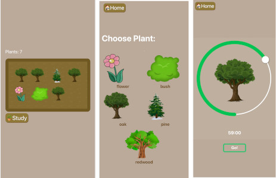

# Study Garden Webapp

Forest app reacreation with React, MongoDB, Express, and Node.



Setup:
- In ```/client```, run ```npm install``` and ```npm start```
- Connect a MongoDB Atlas Cluster in ```/server.env``` 
-- Create a '.env' file in the root directory
-- Include the line: CONNECTION_URL=mongodb+srv://<USER>:<PASSWORD>@cluster0.5qf6a.mongodb.net/<databaseName>?retryWrites=true&w=majority
-- Navigate to your Cluster dashboard
-- Click 'Connect'
-- Select 'Connect your application'
-- Optional: add a user to your cluster (to access the database)
-- Copy and Paste the URL
- In ```/server```, run ```npm install``` and ```npm start```

### Todo:
- add progress bar
- handle plant finished scenerios (PlantTimerjs/endIntervalProcess)
- pass in minimum (not easy plants for 30 seconds)
- Warn user when closing timer
- Bonsai garden?
- Give up button is red
https://developer.mongodb.com/how-to/use-atlas-on-heroku/
